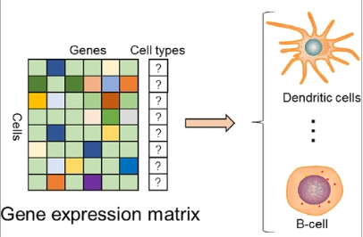
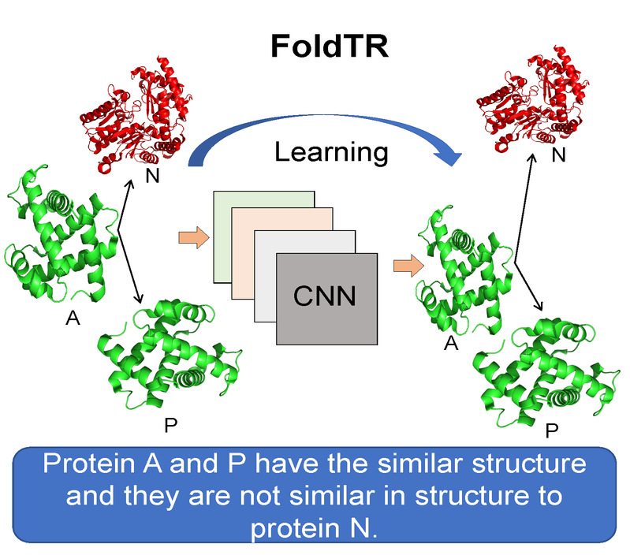
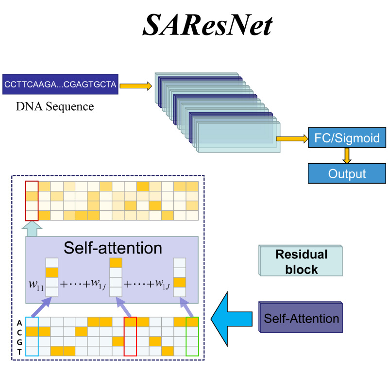
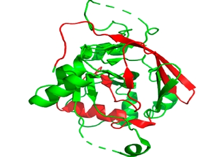
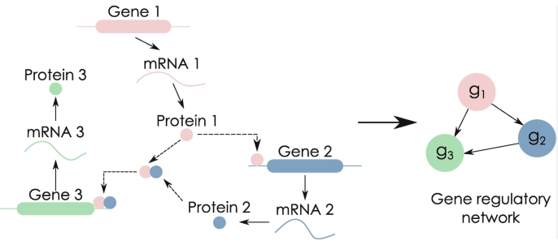

<html>
        <tr>
            <td width="880" valign="baseline">
                

            </td>
        </tr>
        <tr>
            <td width="880" valign="middle" halign="left">
						
							<a name="Publications_">Bioinformatics Servers</a>&nbsp;(<strong>8</strong> Servers), Programmed by Yan Liu</strong>
                
                

            </td>
        </tr>
        <!-- xxxx -->
        <tr>
            <td width="880">
                <table width="880" border="0">
                    <tbody>
                    <tr>
                        <td>
                            
                        </td>
                        <td width="285" align="center">
                            

														
															
																<a style="color:#0000ff;" href="https://github.com/liuyan3056/TripletCell" target="_blank"><strong>TripletCell</strong></a>
															
															 
															<strong>Category</strong>: [Cell Type Prediction]
															 
															<strong>Description</strong>: TripletCell: a deep metric learning framework for accurate annotation of cell types at the single-cell level
															 
															<strong>Journal</strong>: <strong>Briefings in Bioinformatics</strong>
															 
															
																<strong>
																	<a href="https://doi.org/10.1093/bib/bbad132" target=_blank>DOI:</a>
																</strong>
															&nbsp;10.1093/bib/bbad132
															 
															<strong>Year</strong>: <strong>2023</strong>
														
                            

                        </td>
                        <td>
                            
                        </td>
                        <td width="285" style="text-align:left;">
                            

										
											
												<a style="color:#0000ff;"
                                                   href="https://github.com/LMC0705/annotate_celltype" target="_blank"><strong>ICCPred</strong></a>
											
											 
											<strong>Category</strong>: [Cell Type Prediction]
											 
											<strong>Description</strong>: Learning Cell Annotation under Multiple Reference Datasets by Multi-source Domain Adaptation
											 
											<strong>Journal</strong>: <strong>Journal of Chemical Information and Modeling</strong>
											 
															
																<strong>
																	<a href="https://doi.org/10.1021/acs.jcim.2c01277" target=_blank>DOI:</a>
																</strong>
															&nbsp;10.1021/acs.jcim.2c01277
															 
															<strong>Year</strong>: <strong>2023</strong>
										
                            

                        </td>
                    </tr>
                    </tbody>
                </table>
            </td>
        </tr>
        <!-- xxxx -->
        <tr>
            <td width="880">
                <table width="880" border="0">
                    <tbody>
                    <tr>
                        <td>
                            
                        </td>
                        <td width="285" align="center">
                            

										
											
												<a style="color:#0000ff;" href="https://csbio.njust.edu.cn/bioinf/vggfold/"
                                                   target="_blank"><strong>VGGFold</strong></a>
											
											 
											<strong>Category</strong>: [Protein fold prediction]
											 
											<strong>Description</strong>: Why can deep convolutional neural networks improve protein fold recognition? A visual explanation by interpretation
											 
<strong>Journal</strong>: <strong>Briefings in Bioinformatics</strong>
															 
															
																<strong>
																	<a href="https://doi.org/10.1093/bib/bbab001" target=_blank>DOI:</a>
																</strong>
															&nbsp;10.1093/bib/bbab001
															 
															<strong>Year</strong>: <strong>2021</strong>
										
                            

                        </td>
                        <td>
                            
                        </td>
                        <td width="285" style="text-align:left;">
                            

										
											
												<a style="color:#0000ff;"
                                                   href="https://csbio.njust.edu.cn/bioinf/foldtr/" target="_blank"><strong>FoldTR</strong></a>
											
											 
											<strong>Category</strong>: [Protein fold prediction]
											 
											<strong>Description</strong>: Improving protein fold recognition using triplet network and ensemble deep learning
											 
											<strong>Journal</strong>: <strong>Briefings in Bioinformatics</strong>
															 
															
																<strong>
																	<a href="https://doi.org/10.1093/bib/bbab248" target=_blank>DOI:</a>
																</strong>
															&nbsp;10.1093/bib/bbab248
															 
															<strong>Year</strong>: <strong>2021</strong>
										
                            

                        </td>
                    </tr>
                    </tbody>
                </table>
            </td>
        </tr>
        <!-- xxxx -->
        <tr>
            <td width="880">
                <table width="880" border="0">
                    <tbody>
                    <tr>
                        <td>
                            
                        </td>
                        <td width="285" align="center">
                            

										
											
												<a style="color:#0000ff;" href="https://csbio.njust.edu.cn/bioinf/saresnet/"
                                                   target="_blank"><strong>SAResNet</strong></a>
											
											 
											<strong>Category</strong>: [DNA-Protein binding]
											 
											<strong>Description</strong>: SAResNet: self-attention residual network for predicting DNA-protein binding
											 
											<strong>Journal</strong>: <strong>Briefings in Bioinformatics</strong>
															 
															
																<strong>
																	<a href="https://doi.org/10.1093/bib/bbab101" target=_blank>DOI:</a>
																</strong>
															&nbsp;10.1093/bib/bbab101
															 
															<strong>Year</strong>: <strong>2021</strong>
										
                            

                        </td>
                        <td>
                            
                        </td>
                        <td width="285" style="text-align:left;">
                            

										
											
												<a style="color:#0000ff;"
                                                   href="https://zhanggroup.org/TripletGO/" target="_blank"><strong>TripletGO</strong></a>
											
											 
											<strong>Category</strong>: [Protein function prediction]
											 
											<strong>Description</strong>: Integrating Transcript Expression Profiles with Protein Homology Inferences for Gene Function Prediction
											 
											<strong>Journal</strong>: <strong>Genomics Proteomics Bioinformatics</strong>
															 
															
																<strong>
																	<a href="https://doi.org/10.1016/j.gpb.2022.03.001" target=_blank>DOI:</a>
																</strong>
															&nbsp;10.1016/j.gpb.2022.03.001
															 
															<strong>Year</strong>: <strong>2022</strong>
										
                            

                        </td>
                    </tr>
                    </tbody>
                </table>
            </td>
        </tr>
        <!-- xxxx -->
        <tr>
            <td width="880">
                <table width="880" border="0">
                    <tbody>
                    <tr>
                        <td>
                            
                        </td>
                        <td width="285" align="center">
                            

										
											
												<a style="color:#0000ff;" href="https://github.com/zhuguanyu123/NPCFold"
                                                   target="_blank"><strong>NPCFold</strong></a>
											
											 
											<strong>Category</strong>: [Protein fold recognition]
											 
											<strong>Description</strong>: Learning Protein Embedding to Improve Protein Fold Recognition Using Deep Metric Learning
											 
											<strong>Journal</strong>: <strong>Journal of Chemical Information and Modeling</strong>
											 
											<strong><a
                                                    href="https://doi.org/10.1021/acs.jcim.2c00959"
                                                    target=_blank>DOI:</a></strong>&nbsp;10.1021/acs.jcim.2c00959
											 
											<strong>Year</strong>: <strong>2022</strong>
										
                            

                        </td>
                        <td>
                            
                        </td>
                        <td width="285" style="text-align:left;">
                            

										
											
												<a style="color:#0000ff;"
                                                   href="https://github.com/Truth123/GCmapCrys"
                                                   target="_blank"><strong>GMFGRN</strong></a>
											
											 
											<strong>Category</strong>: [Gene Regulatory network Inference]
											 
											<strong>Description</strong>: GMFGRN: a matrix factorization and graph neural network approach for gene regulatory network inference
											 
											<strong>Journal</strong>: <strong>Briefings in Bioinformatics</strong>
											 
											<strong><a
                                                    href="https://doi.org/10.1093/bib/bbad529"
                                                    target=_blank>DOI:</a></strong>&nbsp;10.1093/bib/bbad529
											 
											<strong>Year</strong>: <strong>2023</strong>
										
                            

                        </td>
                    </tr>
                    </tbody>
                </table>
            </td>
        </tr>
        <!-- xxxx -->

        </tbody>
    </table>

</body>
</html>
